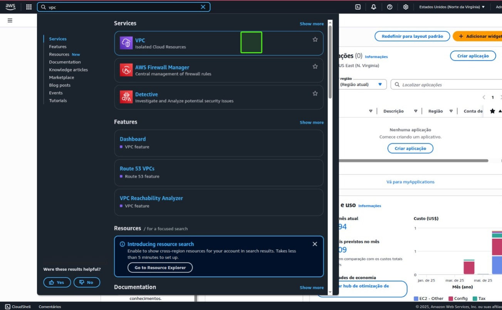
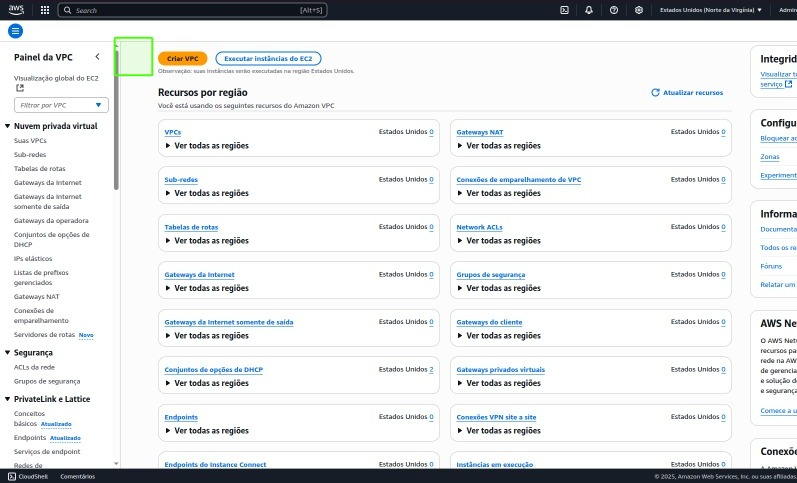
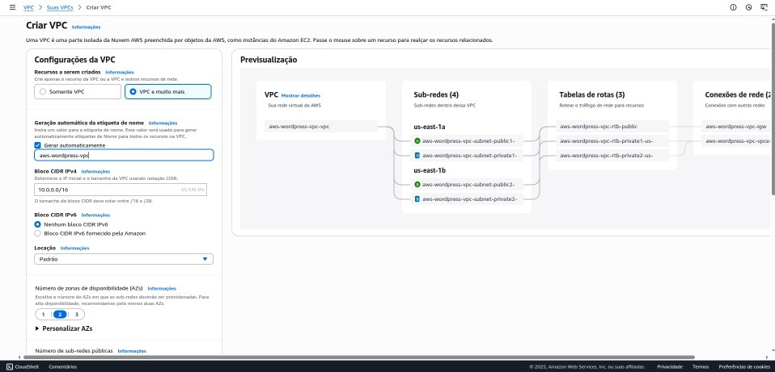
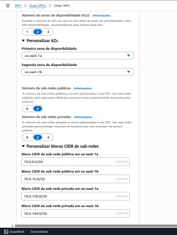
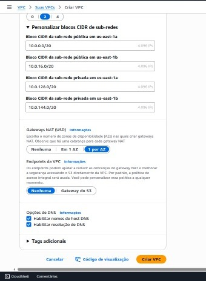
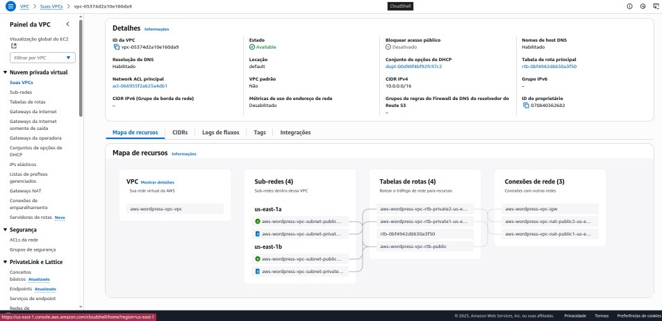

# Etapa 01 — Criação de uma VPC Personalizada na AWS

Este projeto integra minha jornada de capacitação prática na **Compass UOL**. Nesta primeira etapa, foi iniciada a construção da infraestrutura de rede na **Amazon Web Services (AWS)**, com a criação de uma **VPC personalizada** e os recursos fundamentais de conectividade.
Todas as configurações foram realizadas manualmente via **Console da AWS**, com o objetivo de consolidar o entendimento visual e prático de cada recurso de rede envolvido.

---

## Conceito de VPC

A **VPC (Virtual Private Cloud)** é uma rede virtual isolada dentro da AWS. Ela permite controle preciso sobre o tráfego entre subnets, instâncias e serviços, de maneira semelhante à estrutura de redes em um data center tradicional, porém com a flexibilidade e escalabilidade proporcionadas pela nuvem.

---

## Finalidade da VPC neste Projeto

A VPC desenvolvida serve como **fundamento da arquitetura** que será construída nas etapas seguintes. Entre seus objetivos, destacam-se:

* Prover um ambiente seguro e isolado para os recursos computacionais;
* Controlar o tráfego de entrada e saída da infraestrutura por meio de componentes como Internet Gateway e NAT Gateway;
* Integrar de forma segura os serviços EC2, RDS e EFS;
* Garantir alta disponibilidade e organização lógica entre subnets públicas e privadas;
* Restringir a exposição desnecessária à internet, adotando políticas de acesso controlado.

---

## Etapas de Configuração

A seguir, são descritas as etapas realizadas nesta fase, acompanhadas por imagens ilustrativas da configuração no Console da AWS:

### 1. Criação da VPC

* **Nome:** `vpc-compass`
* **CIDR block:** `10.0.0.0/16` — Faixa de endereçamento IP privado da rede.

  

  

  

---

### 2. Configuração das Subnets

A VPC foi dividida em **quatro subnets**, distribuídas entre duas zonas de disponibilidade, de forma a garantir tolerância a falhas e alta disponibilidade.

**Subnets Públicas:**

* `subnet-publica-1` – us-east-1a
* `subnet-publica-2` – us-east-1b

**Subnets Privadas:**

* `subnet-privada-1` – us-east-1a
* `subnet-privada-2` – us-east-1b

  

---

### 3. Internet Gateway (IGW)

Foi criado um Internet Gateway para permitir que as **subnets públicas** tenham acesso à internet.

* **Nome:** `igw-compass`
* **Associado à VPC:** `vpc-compass`

  

---

### 4. Tabela de Rotas

Foi configurada uma Route Table para redirecionar o tráfego de saída das subnets públicas para a internet por meio do IGW.

* **Destino:** `0.0.0.0/0`
* **Gateway:** `igw-compass`

---

### 5. Associação das Subnets à Tabela de Rotas

Somente as subnets públicas foram associadas à nova tabela de rotas, de modo a manter as subnets privadas isoladas da internet.

  

---

## Considerações Técnicas

* As subnets foram distribuídas entre zonas de disponibilidade distintas (`us-east-1a` e `us-east-1b`) para maximizar a **resiliência da infraestrutura**.
* Os nomes dos recursos seguem um padrão padronizado para **facilitar a gestão e manutenção**.
* A configuração manual via Console da AWS proporcionou **uma compreensão aprofundada da topologia de rede** e suas dependências.
