# Etapa 02 — Configuração dos Security Groups na AWS

Nesta etapa, foram configurados os **Security Groups (SGs)** — firewalls virtuais fornecidos pela AWS — com o propósito de controlar o tráfego de rede entre os recursos da infraestrutura. O foco principal foi assegurar **isolamento e segurança**, permitindo somente comunicações necessárias para o funcionamento adequado do ambiente.

---

## Conceito de Security Groups

Os **Security Groups** consistem em conjuntos de regras de segurança que determinam quais tipos de tráfego podem ingressar ou sair de instâncias e serviços dentro da VPC. Por serem **stateful**, toda conexão permitida na entrada tem sua respectiva resposta automaticamente liberada na saída, dispensando regras adicionais.

---

## Finalidade dos Security Groups neste Projeto

A configuração dos SGs teve os seguintes objetivos:

* Restringir o acesso às **instâncias EC2**, liberando conexões SSH exclusivamente para o IP de origem autorizado;
* Permitir que o **Load Balancer** receba tráfego HTTP e HTTPS diretamente da internet;
* Garantir que a comunicação entre as **instâncias EC2 e o banco de dados RDS** ocorra de maneira privada e segura;
* Controlar o acesso ao **Elastic File System (EFS)**, assegurando que apenas instâncias autorizadas possam montar os volumes;
* Minimizar a superfície de ataque, bloqueando qualquer tráfego desnecessário.

---

## Security Groups Criados

### 1. SG para EC2 (Servidores de Aplicação)

* **Nome:** `ec2-sg`
* **Descrição:** Controla o tráfego de entrada e saída das instâncias EC2

**Regras de Entrada (Inbound):**

* Porta 22 (SSH): liberada somente para o IP autorizado, garantindo acesso remoto seguro;
* Porta 80 (HTTP): liberada para o SG do Load Balancer (`lb-sg`);
* Porta 443 (HTTPS): liberada para o SG do Load Balancer (`lb-sg`);
* Porta 2049 (NFS): liberada para o SG do EFS (`efs-sg`) para permitir a montagem do sistema de arquivos.

**Regras de Saída (Outbound):**

* Todo o tráfego (`0.0.0.0/0`) liberado, permitindo atualizações e comunicação com serviços externos como RDS e EFS.

---

### 2. SG para RDS (Banco de Dados MySQL)

* **Nome:** `rds-sg`
* **Descrição:** Controla o acesso ao banco de dados

**Regras de Entrada:**

* Porta 3306 (MySQL): liberada exclusivamente para o SG da EC2 (`ec2-sg`), restringindo o acesso ao banco.

**Regras de Saída:**

* Todo o tráfego liberado, garantindo a resposta das conexões estabelecidas.

---

### 3. SG para EFS (Elastic File System)

* **Nome:** `efs-sg`
* **Descrição:** Define as permissões de acesso ao sistema de arquivos compartilhado

**Regras de Entrada:**

* Porta 2049 (NFS): liberada apenas para o SG da EC2 (`ec2-sg`), permitindo a montagem segura dos volumes.

**Regras de Saída:**

* Todo o tráfego liberado para comunicação bidirecional com as instâncias.

---

### 4. SG para Load Balancer

* **Nome:** `lb-sg`
* **Descrição:** Controla o tráfego externo direcionado ao Load Balancer

**Regras de Entrada:**

* Porta 80 (HTTP) e 443 (HTTPS): liberadas para toda a internet (`0.0.0.0/0`), permitindo acesso público à aplicação.

**Regras de Saída:**

* Portas 80 e 443: liberadas para o SG da EC2 (`ec2-sg`), possibilitando o redirecionamento do tráfego às instâncias.

---

## Visualização dos Security Groups

  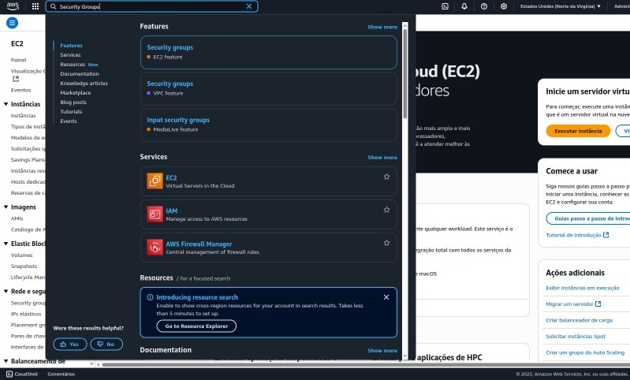

  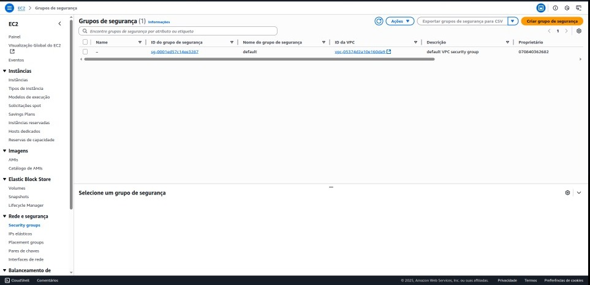

  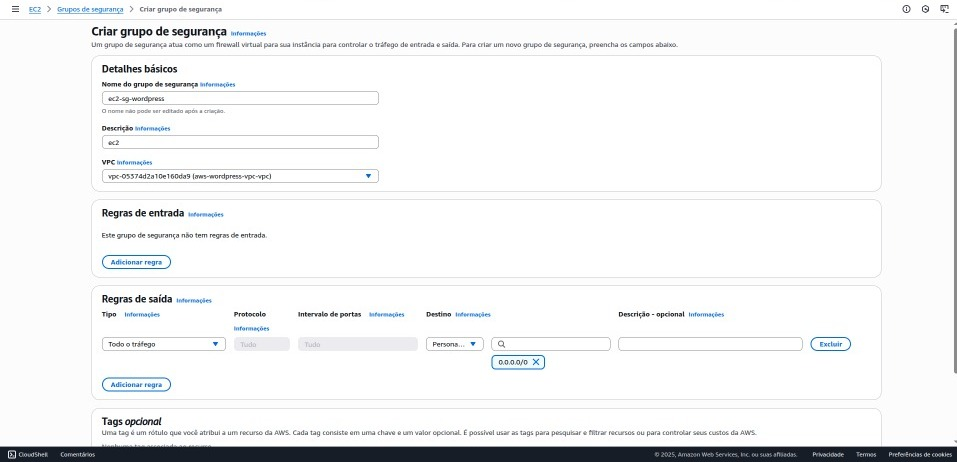

  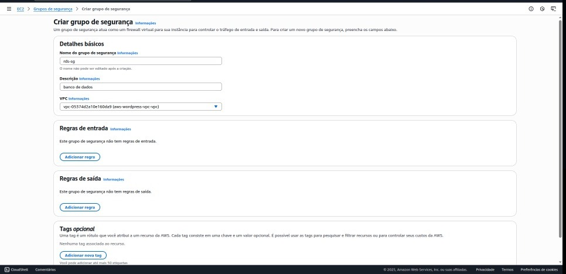

  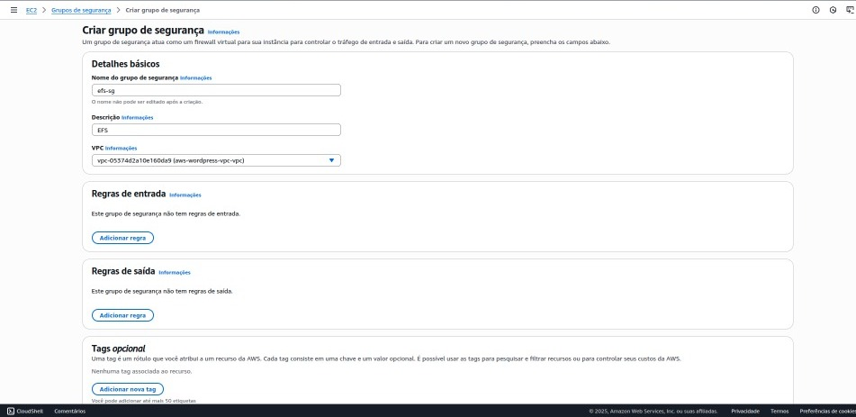

  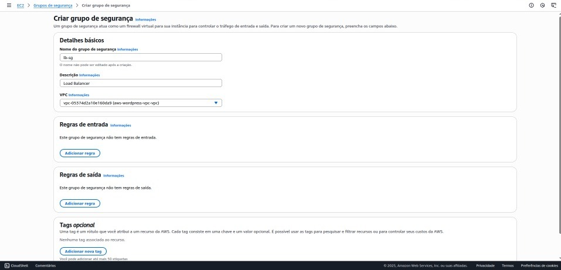

  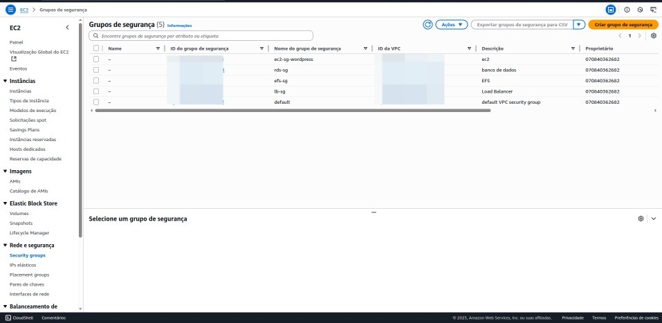

---

## Regras de Entrada e Saída por Grupo

  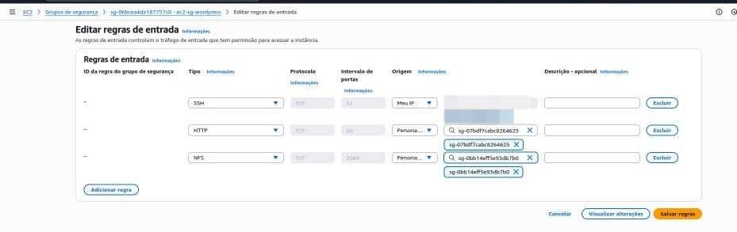

  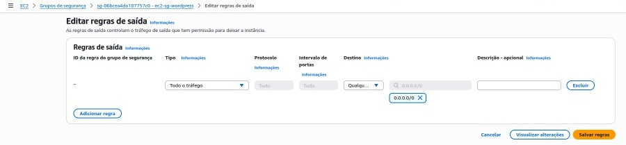

  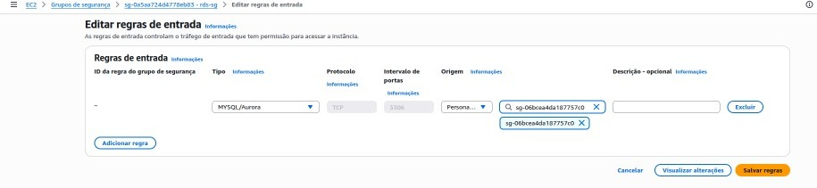

  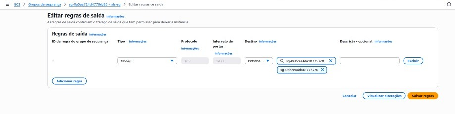

  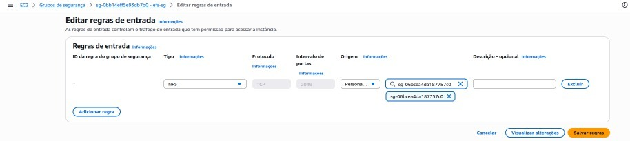

  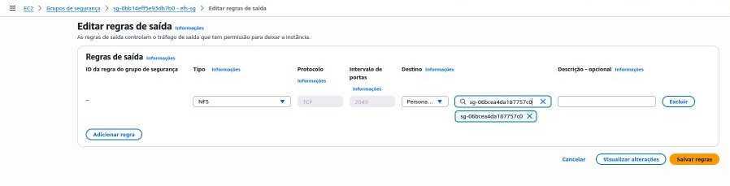

  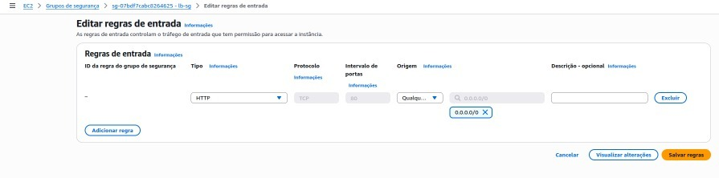

  

---

## Considerações Técnicas

* Todos os Security Groups foram devidamente associados aos serviços correspondentes, dentro da mesma VPC personalizada;
* As regras seguem o **princípio do menor privilégio**, permitindo apenas o tráfego essencial ao funcionamento da aplicação;
* A configuração promove **segurança, segmentação e escalabilidade**, mantendo a infraestrutura protegida contra acessos não autorizados.

---

## ⏭ Próximos Passos

Com os Security Groups devidamente configurados, a etapa seguinte será a criação do **Elastic File System (EFS)**, que permitirá armazenamento compartilhado entre instâncias EC2.

---

  <strong> A organização estratégica dos Security Groups é essencial para a proteção e integridade de toda a arquitetura em nuvem.</strong>

