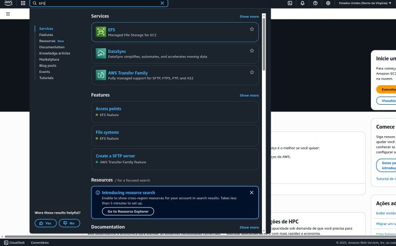
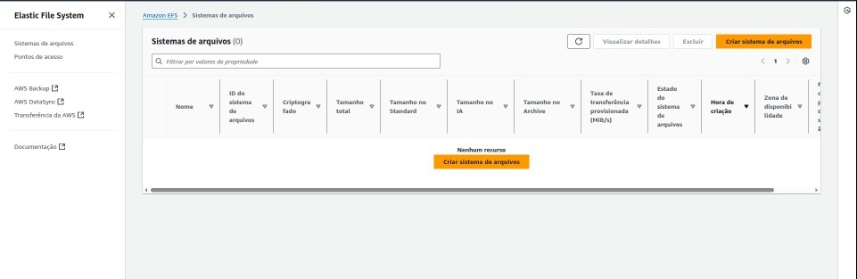
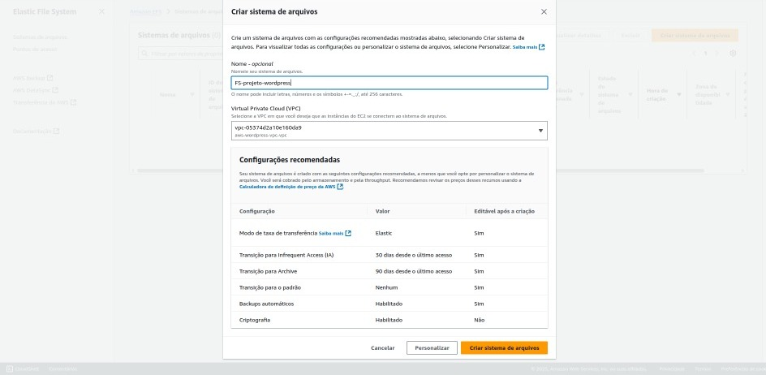
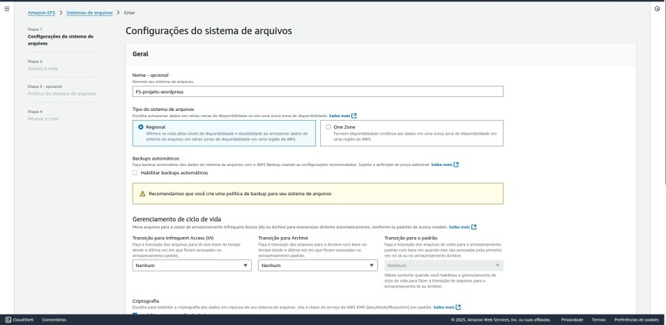
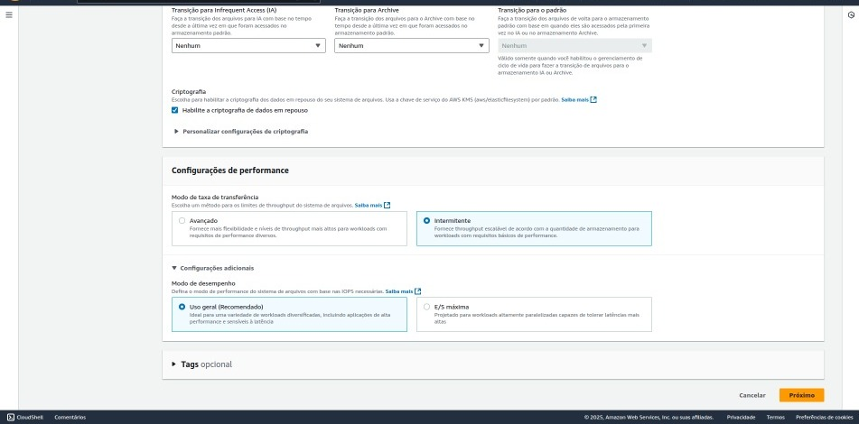
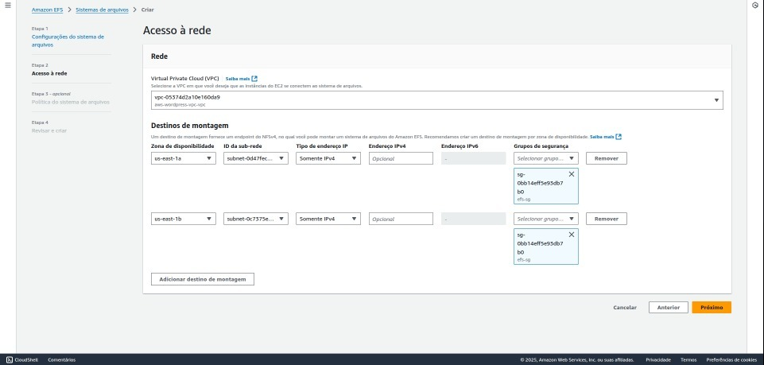
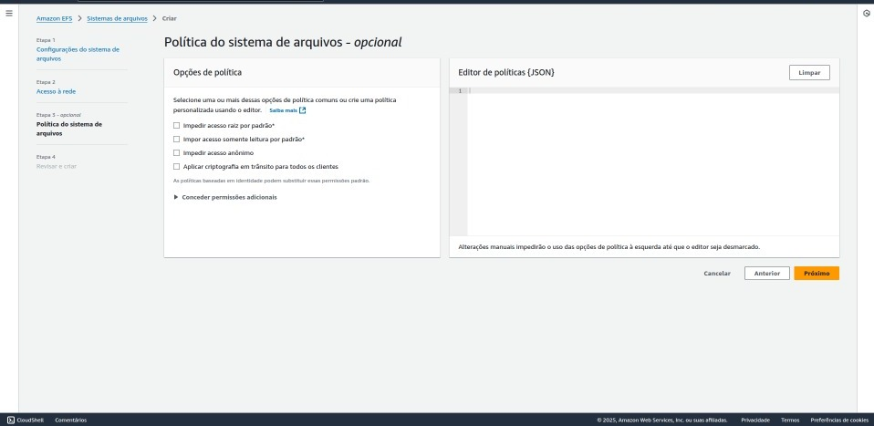
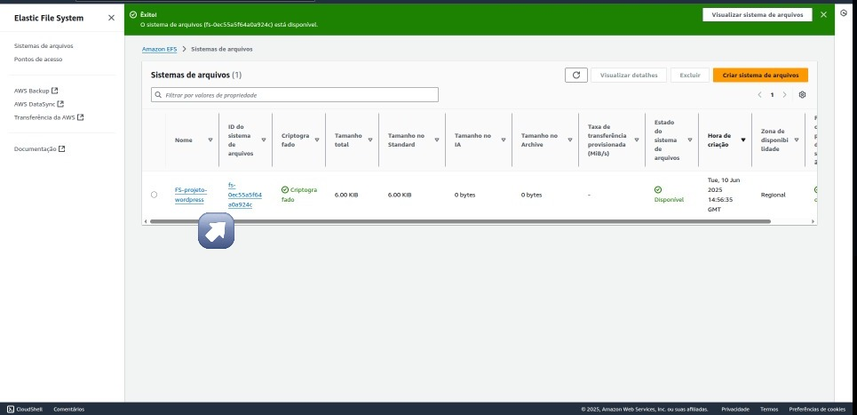

# Etapa 03 – Criação do Amazon EFS (Elastic File System)

Nesta etapa, foi criado o **Amazon Elastic File System (EFS)**, um sistema de arquivos gerenciado e escalável que permite que múltiplas instâncias EC2 acessem os mesmos dados simultaneamente. Essa configuração é essencial para aplicações distribuídas, como o WordPress, que utilizam Auto Scaling e demandam sincronização contínua de arquivos entre instâncias.

---

## O que é o Amazon EFS?

O **EFS (Elastic File System)** é um serviço de armazenamento em rede da AWS que fornece um sistema de arquivos elástico, acessível de forma simultânea por diversas instâncias EC2 por meio do protocolo NFS (Network File System).

Diferentemente do EBS, que é acoplado a uma única instância, o EFS pode ser montado por diversas instâncias ao mesmo tempo, o que o torna ideal para ambientes em que o conteúdo do servidor precisa estar sincronizado e persistente, como uploads, plugins e temas do WordPress.

---

## Objetivo do EFS neste projeto

* Permitir o compartilhamento de dados entre todas as instâncias EC2 da aplicação.
* Garantir a persistência e consistência dos arquivos utilizados pelo WordPress.
* Integrar o sistema de arquivos à infraestrutura de forma automatizada, por meio do script de inicialização das instâncias.

---

## Etapas de criação do EFS

### 1. Acesso ao serviço

No console da AWS, foi acessado o serviço EFS por meio da barra de pesquisa. Em seguida, selecionou-se a opção **"File systems"** no menu lateral para iniciar a criação do sistema de arquivos.

<p align="center"></p>
<p align="center"></p>

---

### 2. Criação do sistema de arquivos

Clicou-se em **"Create file system"**, e foi atribuído um nome identificador, como `efs-wordpress`. Na sequência, foi selecionada a mesma VPC utilizada na criação das instâncias EC2 e dos demais recursos.

<p align="center"></p>

---

### 3. Configurações principais

As configurações definidas foram as seguintes:

* Tipo de sistema: **Regional**, permitindo acesso entre múltiplas zonas de disponibilidade.
* Backups automáticos: desativados neste momento (opcional).
* Modo de throughput: **Bursting**, adaptando-se automaticamente à demanda.
* Modo de performance: **General Purpose**, ideal para cargas gerais como WordPress.

<p align="center"></p>
<p align="center"></p>

---

### 4. Configuração de rede e segurança

Foi selecionado o conjunto de sub-redes privadas da VPC (por exemplo, `us-east-1a` e `us-east-1b`). Também foi atribuído ao EFS o **Security Group `efs-sg`**, configurado previamente com a liberação da porta **2049** (protocolo NFS) para o grupo de segurança das instâncias EC2 (`ec2-sg`).

<p align="center"></p>

---

### 5. Conclusão da criação

Após revisar as configurações nas etapas subsequentes, o sistema de arquivos foi criado clicando em **"Create"**.

<p align="center"></p>

---

## Identificador do sistema de arquivos

Após a criação, foi gerado um identificador único para o EFS no formato `fs-xxxxxxxx`. Esse ID será necessário para realizar a montagem automática do volume EFS nas instâncias EC2 por meio do script de inicialização (UserData).

<p align="center"></p>

---

## Montagem manual via SSH (opcional)

Caso seja necessário montar o EFS manualmente em uma instância EC2, os seguintes comandos podem ser utilizados:

```bash
sudo yum install -y amazon-efs-utils
sudo mkdir /mnt/efs
sudo mount -t efs fs-xxxxxxxx:/ /mnt/efs
```

> Substituir `fs-xxxxxxxx` pelo ID real do EFS.
> Essa montagem é temporária; para persistência, recomenda-se utilizar o arquivo `/etc/fstab` ou realizar a montagem via UserData.

---

## Observações importantes

* O EFS foi configurado em sub-redes privadas, com acesso restrito por meio de Security Groups.
* A comunicação entre EC2 e EFS foi protegida, permitindo apenas tráfego pela porta 2049 (NFS).
* Essa abordagem garante consistência entre as instâncias e simplifica o gerenciamento de arquivos em ambientes escaláveis.

---

## Próximos passos

Com o EFS provisionado e integrado à VPC, a próxima etapa será a criação do **Amazon RDS**, responsável pelo provisionamento do banco de dados MySQL utilizado pelo WordPress.