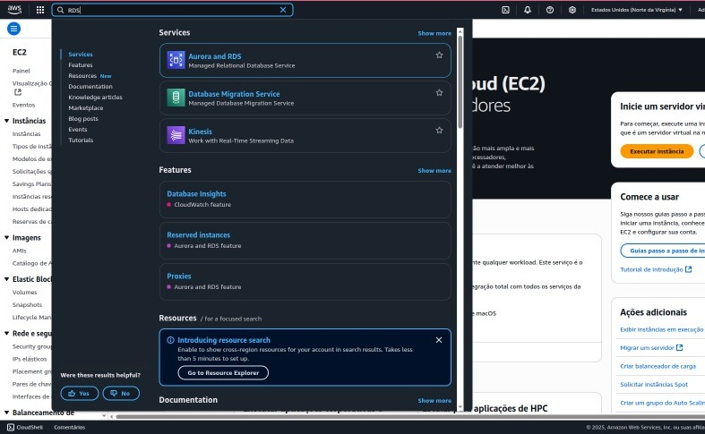
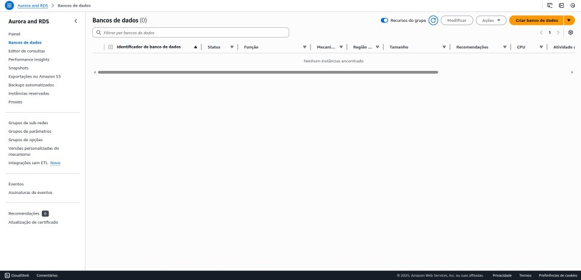
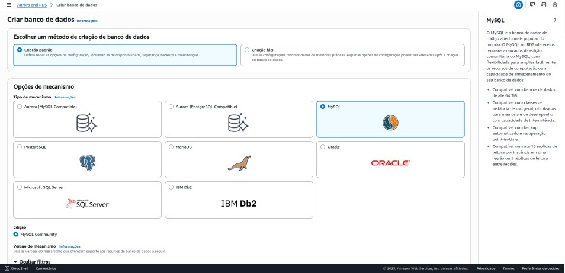
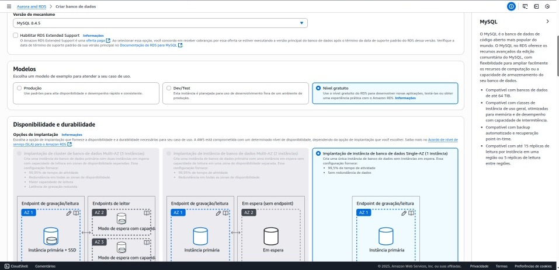
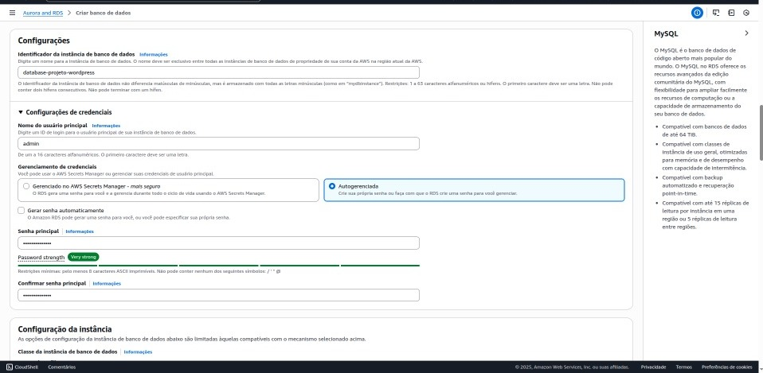
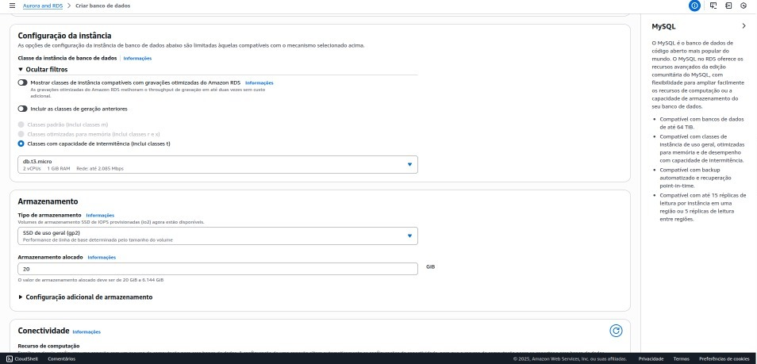
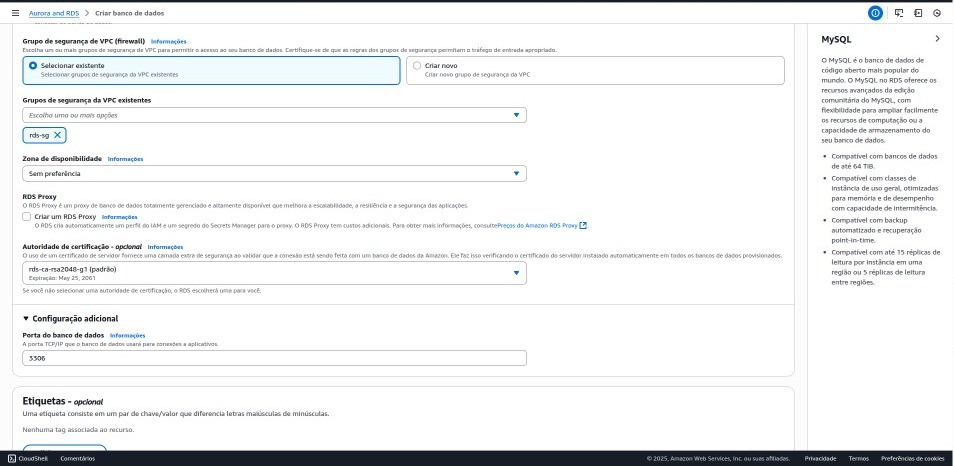
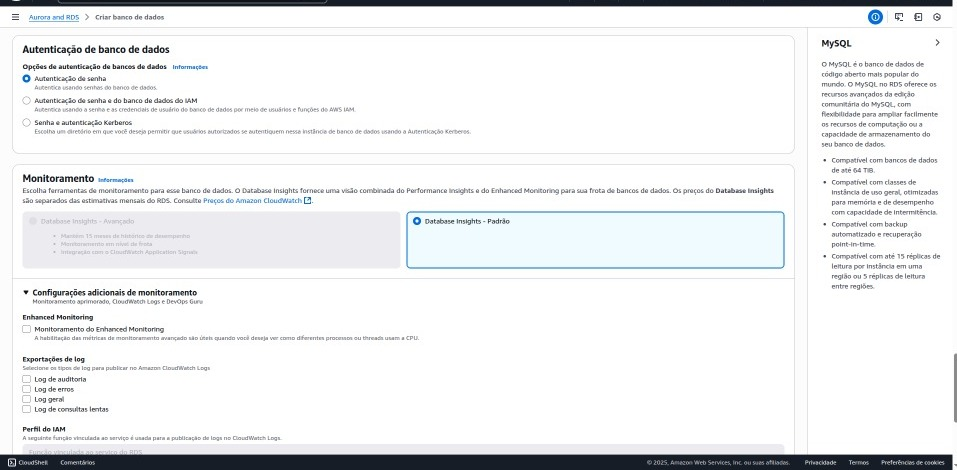

# Etapa 04 – Criação do Amazon RDS (MySQL)

Nesta etapa, foi provisionado um banco de dados relacional gerenciado por meio do serviço **Amazon RDS**, utilizando o mecanismo **MySQL**, amplamente compatível com o WordPress. A utilização de um banco externo à instância EC2 favorece a escalabilidade, resiliência e a separação de responsabilidades entre aplicação e dados.

---

## O que é o Amazon RDS?

O **Amazon Relational Database Service (RDS)** é um serviço gerenciado que simplifica o processo de criação, operação e escalabilidade de bancos de dados relacionais na nuvem. Ele cuida de tarefas como provisionamento de hardware, aplicação de patches, backups automáticos e alta disponibilidade, permitindo que a equipe se concentre na aplicação.

---

## Objetivo do RDS neste projeto

* Fornecer uma instância de banco de dados dedicada ao WordPress, desacoplada da instância de aplicação.
* Garantir alta disponibilidade e segurança dos dados armazenados.
* Facilitar a escalabilidade da aplicação em ambientes com múltiplas instâncias EC2.

---

## Etapas de criação do RDS

### 1. Acesso ao serviço

No Console da AWS, foi acessado o serviço **Amazon RDS** por meio da barra de pesquisa. Em seguida, clicou-se em **Databases**, no menu lateral esquerdo, e posteriormente em **Create database**.

<p align="center"></p>
<p align="center"></p>

---

### 2. Seleção do mecanismo de banco de dados

Na etapa de seleção do mecanismo, foi escolhido:

* **Engine**: MySQL
* **Versão**: a mais recente e estável disponível (por exemplo, `MySQL 8.x`)

<p align="center"></p>

---

### 3. Configuração da instância

As definições da instância foram as seguintes:

* **Template**: Free tier (para contas gratuitas) ou Dev/Test (para ambientes de desenvolvimento)
* **DB Instance Identifier**: `wordpress-db`
* **Master Username**: `admin` (ou outro nome definido)
* **Senha**: definida com critérios de segurança apropriados

<p align="center"></p>
<p align="center"></p>
<p align="center"></p>

---

### 4. Configuração de rede

Nesta etapa, foram aplicadas as seguintes configurações:

* **VPC**: selecionada a mesma utilizada para os demais recursos
* **Subnets**: selecionadas as sub-redes privadas
* **Public access**: configurado como **No**, para impedir exposição pública
* **Availability zone**: mantida como **No preference**
* **Security Group**: atribuído o grupo `rds-sg`, com a porta **3306** liberada exclusivamente para o grupo de segurança das instâncias EC2 (`ec2-sg`)

<p align="center"></p>
<p align="center"></p>
<p align="center"></p>

---

### 5. Configurações adicionais

* **Armazenamento**: mantido o padrão (por exemplo, 20 GB, suficiente para testes)
* **Backups automáticos**: desativados para evitar custos adicionais durante o desenvolvimento
* **Monitoramento e manutenção**: desativados neste momento

---

### 6. Conclusão da criação

Após revisar todas as configurações, clicou-se em **Create database**. A criação da instância pode levar alguns minutos até atingir o status **“Available”**.

---

## Informações de conexão

Após a criação, foi disponibilizado o **endpoint de conexão** da instância RDS, no formato:

```
wordpress-db.xxxxxxxxx.us-east-1.rds.amazonaws.com
```

Esse endpoint será utilizado no arquivo `wp-config.php` da aplicação WordPress para estabelecer a comunicação com o banco de dados.

---

## Regras de segurança – Porta 3306

É fundamental garantir que o **Security Group do RDS** permita acesso à porta **3306** **exclusivamente** para o grupo de segurança associado às instâncias EC2. O acesso público a essa porta deve permanecer bloqueado por questões de segurança.

---

## Próximos passos

Com o RDS configurado e disponível, a próxima etapa será a integração completa entre os serviços provisionados, por meio do **UserData** da instância EC2. Esse script automatizará a montagem do EFS e a instalação/configuração do WordPress com base nas variáveis do ambiente.