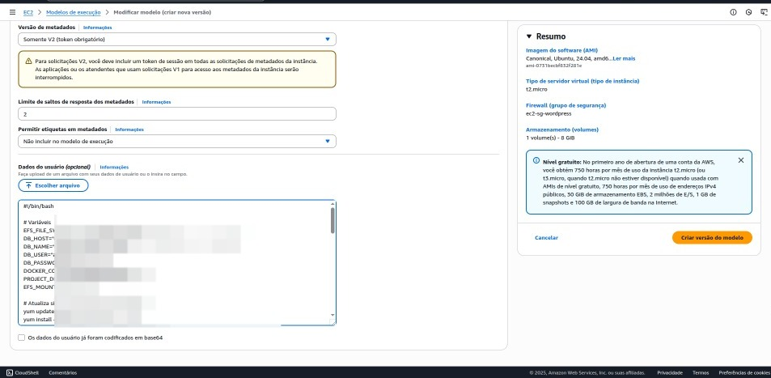

# Etapa 05 – Criação do Launch Template (Amazon Linux com EFS + RDS + Docker)

Nesta etapa, será criado um Launch Template para provisionamento automatizado de instâncias EC2 utilizando a imagem Amazon Linux 2. O script de inicialização (UserData) inclui a instalação do Docker, a montagem do sistema de arquivos EFS e a configuração da aplicação WordPress conectada a um banco de dados RDS. Essa abordagem permite padronizar a infraestrutura, facilitando o uso com Auto Scaling Groups e Load Balancers.

## O que é o Launch Template?

O Launch Template é um recurso do Amazon EC2 que permite definir previamente configurações para as instâncias, como a AMI, tipo, chave SSH, grupos de segurança e scripts de inicialização. Ele é essencial para garantir o provisionamento consistente e escalável das instâncias, principalmente quando integrado a Auto Scaling Groups.

## Objetivo do Launch Template neste projeto

* Automatizar a criação de instâncias EC2 configuradas com Docker, WordPress e integração ao EFS e RDS.
* Garantir consistência na configuração de instâncias para escalabilidade e manutenção simplificada.
* Facilitar a gestão e automação da infraestrutura.

## Observação importante

Embora o exemplo utilize Amazon Linux 2, o procedimento e o script podem ser adaptados para Ubuntu Server, conforme preferência do ambiente.

---

## Passos para criação do Launch Template

### 1. Acesso ao serviço EC2

No Console da AWS, acesse o serviço EC2 utilizando a barra de pesquisa. No menu lateral, clique em **Launch Templates** e, em seguida, em **Create launch template**.

<p align="center"></p> 
<p align="center"></p> 

---

### 2. Definição de nome e descrição do template

Configure os campos da seguinte forma:

* **Template name**: `MyTemplateWordPress`
* **Template version description**: `Template com Docker, EFS e RDS`
* Marque a opção **Provide guidance to help me set up a template that I can use with EC2 Auto Scaling**

<p align="center"></p> 

---

### 3. Seleção da AMI

Selecione a imagem **Amazon Linux 2 AMI (HVM), SSD Volume Type**, compatível com o script do UserData. Como mencionado, esta etapa pode ser adaptada para uso com Ubuntu Server.

<p align="center"></p> 

---

### 4. Tipo de instância e chave SSH

Configure o tipo da instância e a chave SSH conforme abaixo:

* **Instance type**: `t2.micro`
* **Key pair (login)**: selecione a chave SSH previamente criada (exemplo: `aws-key-gio.pem`)

<p align="center"></p> 

---

### 5. Script de inicialização (UserData)

No campo UserData, insira o seguinte script, que automatiza a instalação do Docker, montagem do EFS e inicialização do container WordPress com conexão ao banco RDS:

```bash
#!/bin/bash

# Variáveis de configuração
EFS_ID="fs-xxxxxxxx"
DB_HOST="meu-database.xxxxxxxxx.us-east-1.rds.amazonaws.com"
DB_NAME="wordpress"
DB_USER="admin"
DB_PASSWORD="SENHA_FORTE"
MOUNT_DIR="/mnt/efs"
PROJECT_DIR="/home/ec2-user/wordpress"

# Atualização do sistema e instalação de pacotes necessários
yum update -y
yum install -y amazon-efs-utils nfs-utils docker curl

# Inicialização e habilitação do Docker
systemctl start docker
systemctl enable docker
usermod -aG docker ec2-user

# Instalação do Docker Compose
curl -SL https://github.com/docker/compose/releases/latest/download/docker-compose-linux-x86_64 -o /usr/local/bin/docker-compose
chmod +x /usr/local/bin/docker-compose

# Montagem do EFS
mkdir -p ${MOUNT_DIR}
mount -t nfs4 -o nfsvers=4.1 ${EFS_ID}.efs.us-east-1.amazonaws.com:/ ${MOUNT_DIR}
echo "${EFS_ID}.efs.us-east-1.amazonaws.com:/ ${MOUNT_DIR} nfs4 defaults,_netdev 0 0" >> /etc/fstab

# Ajuste de permissões para o volume do WordPress
chown -R 33:33 ${MOUNT_DIR}

# Preparação do diretório do projeto e criação do docker-compose.yml
mkdir -p ${PROJECT_DIR}
cd ${PROJECT_DIR}

cat > docker-compose.yml <<EOL
version: '3.7'
services:
  wordpress:
    image: wordpress:latest
    container_name: wordpress
    environment:
      WORDPRESS_DB_HOST: ${DB_HOST}
      WORDPRESS_DB_NAME: ${DB_NAME}
      WORDPRESS_DB_USER: ${DB_USER}
      WORDPRESS_DB_PASSWORD: ${DB_PASSWORD}
    ports:
      - 80:80
    volumes:
      - ${MOUNT_DIR}:/var/www/html
EOL

# Inicialização do ambiente Docker
docker-compose up -d
```

---

## Considerações finais

* Substitua os valores dos placeholders (`fs-xxxxxxxx`, `DB_HOST`, `SENHA_FORTE`) pelos dados reais do seu ambiente.
* Este template permite criar instâncias configuradas automaticamente para hospedar o WordPress com persistência no EFS e banco de dados RDS dedicado.
* Para ambientes Ubuntu, adapte o script de UserData conforme necessário.

<p align="center"></p> 