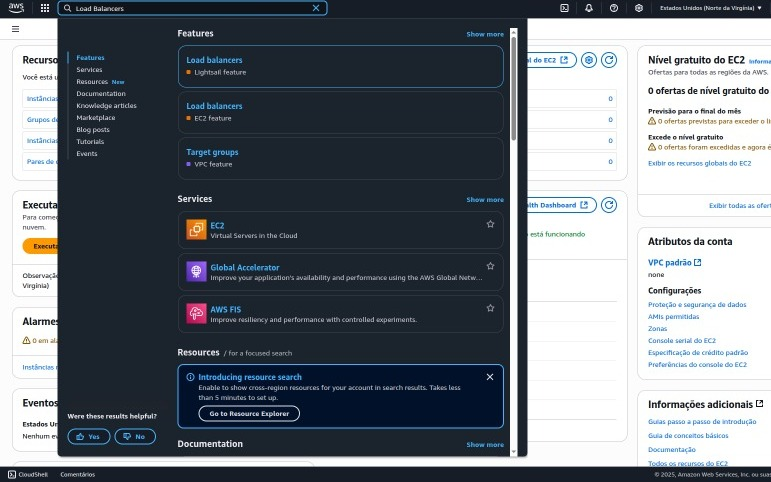
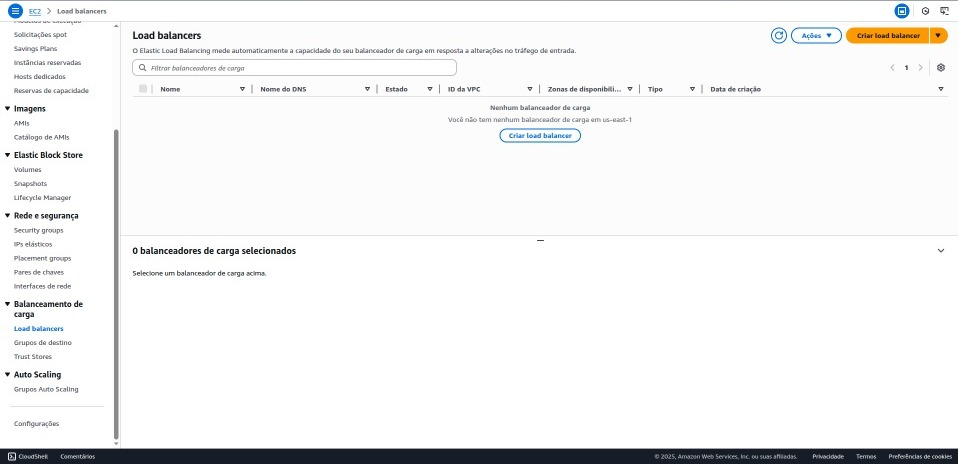
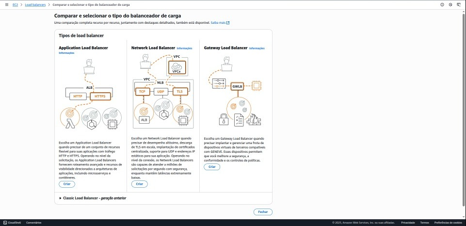
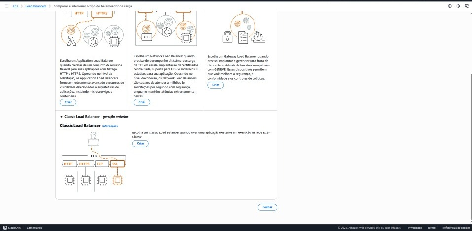
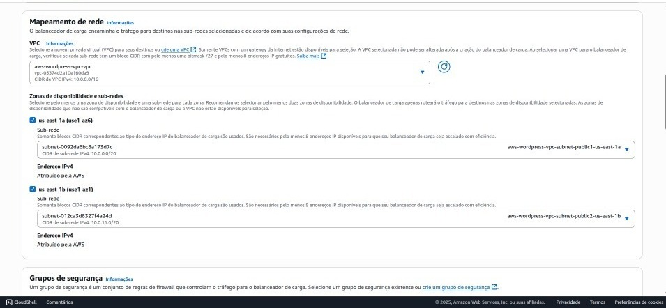
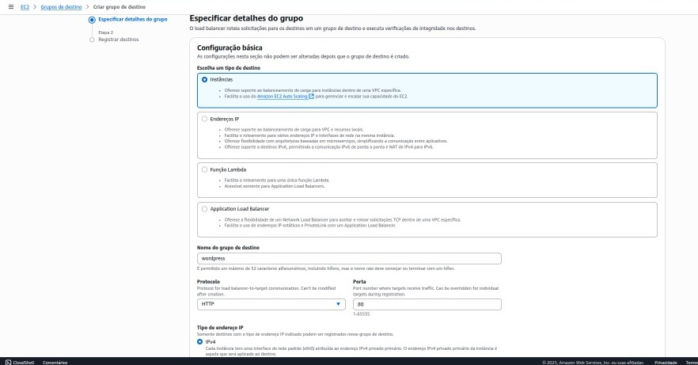
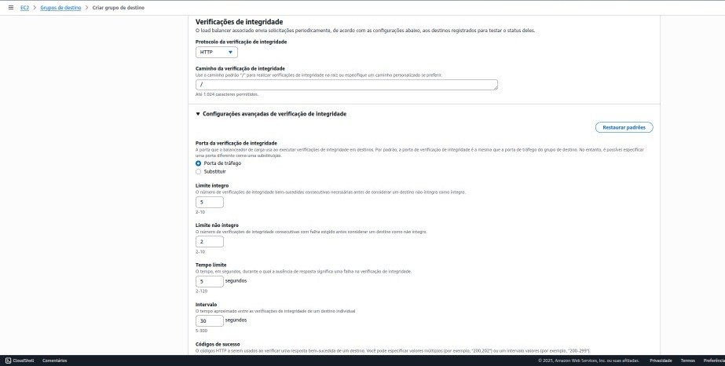
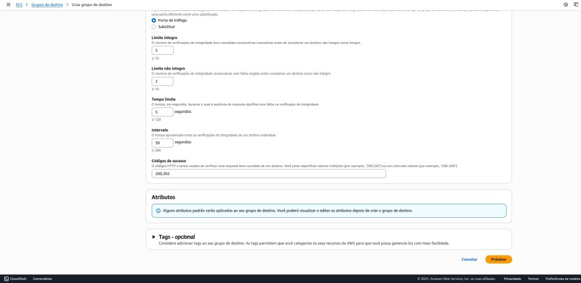

# Etapa 6 – Configuração do Load Balancer AWS para Projeto WordPress

## Objetivo

Esta etapa tem como finalidade configurar um Load Balancer na AWS para distribuir o tráfego entre múltiplas instâncias EC2 que executam a aplicação WordPress, garantindo alta disponibilidade, balanceamento de carga e escalabilidade da solução.

---

## Passos realizados

### 1. Acesso ao serviço Load Balancer

No Console da AWS, acessou-se o serviço EC2 e, no menu lateral, selecionou-se a opção **Load Balancers**. Em seguida, clicou-se em **Create Load Balancer**.

---

### 2. Escolha do tipo de Load Balancer

Foi selecionado o tipo **Application Load Balancer**, adequado para balanceamento na camada de aplicação (camada 7), com suporte a HTTP e HTTPS.

Definiu-se o nome do Load Balancer, o esquema como **internet-facing** para acesso público, e a VPC correspondente ao projeto (`aws-wordpress-vpc`). Também foram selecionadas as zonas de disponibilidade e sub-redes compatíveis.

---

### 3. Configuração do Listener

Configurou-se o listener para escutar na porta 80 (HTTP). Caso necessário, configurou-se também HTTPS utilizando certificado SSL gerenciado pelo AWS Certificate Manager.

Definiu-se o protocolo e porta para encaminhamento do tráfego às instâncias.

---

### 4. Criação do Target Group

Criou-se um Target Group com as seguintes configurações:

* Tipo: Instâncias (Instances)
* Protocolo: HTTP
* Porta: 80
* VPC correta para o ambiente

Configurar-se-ão health checks para monitoramento do status das instâncias e garantir a saúde do ambiente.

---

### 5. Associação das instâncias EC2

As instâncias EC2 que hospedam o WordPress foram associadas ao Target Group, permitindo que o Load Balancer encaminhe as requisições.

Foi verificado o status das instâncias para assegurar que estão marcadas como **healthy** no Target Group.

---

### 6. Configuração do Auto Scaling Group (parcial)

Foi criado um Auto Scaling Group para garantir escalabilidade automática das instâncias EC2.

O Auto Scaling Group foi configurado para utilizar o Launch Template previamente criado e para ser associado ao Load Balancer, permitindo balanceamento automático conforme a demanda.

---

## Considerações finais

* Recomenda-se monitorar constantemente o status de saúde das instâncias no Target Group.
* Ajustar as políticas de Auto Scaling para otimização de custos e desempenho.
* Garantir que os Security Groups estejam configurados para permitir o tráfego necessário entre Load Balancer, instâncias EC2 e demais recursos.
