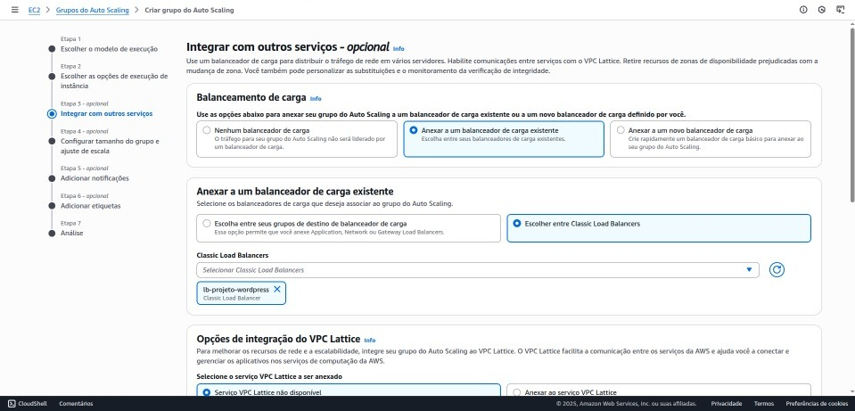

# Etapa 07 – Criação do Auto Scaling Group (ASG)

Nesta etapa, foi criado um Auto Scaling Group para garantir a escalabilidade automática da aplicação WordPress. A integração com o Launch Template e o Load Balancer permite que novas instâncias EC2 sejam provisionadas de forma automatizada e consistente, conforme a demanda do ambiente.

---

## O que é o Auto Scaling Group?

O **Auto Scaling Group (ASG)** é um recurso da AWS que permite escalar automaticamente o número de instâncias EC2 com base em métricas de utilização (como CPU ou tráfego de rede), horários programados ou eventos definidos. Ele ajuda a manter a performance da aplicação e a otimizar os custos operacionais.

---

## Objetivo do Auto Scaling neste projeto

* Prover alta disponibilidade à aplicação WordPress.
* Escalar horizontalmente o número de instâncias EC2 conforme a carga.
* Automatizar o provisionamento de instâncias com base em um modelo padronizado (Launch Template).
* Integrar as novas instâncias automaticamente ao Load Balancer.

---

## Etapas de criação do Auto Scaling Group

### 1. Acesso ao serviço

No Console da AWS, acessou-se o serviço **EC2** e, no menu lateral, selecionou-se **Auto Scaling Groups**. Em seguida, clicou-se em **Create Auto Scaling Group**.

---

### 2. Definição do nome e Launch Template

* **Nome do grupo**: `wordpress-asg`
* **Launch Template**: selecionado o template previamente criado (ex: `MytemplateWordPress`)
* **Versão**: `Default` (ou versão específica, se aplicável)

---

### 3. Seleção da VPC e Sub-redes

Selecionou-se a **VPC** do projeto (`aws-wordpress-vpc`) e as **sub-redes públicas** correspondentes às zonas de disponibilidade desejadas, assegurando alta disponibilidade em múltiplas AZs.

---

### 4. Associação ao Load Balancer

Foi realizada a integração do Auto Scaling Group ao **Application Load Balancer** já configurado, por meio do **Target Group** utilizado na etapa anterior.

* Tipo de Load Balancer: Application Load Balancer
* Target Group: `wordpress-tg`

---

### 5. Definição da capacidade do grupo

Foram definidos os limites de escalabilidade:

* **Desired Capacity**: 1 (capacidade inicial)
* **Minimum Capacity**: 1
* **Maximum Capacity**: 3 (ou outro valor conforme necessidade)

---

### 6. Configuração das políticas de escalonamento

Optou-se pela política de escalonamento com base em **utilização média de CPU**. O grupo escalará automaticamente quando a média de uso da CPU ultrapassar um determinado limiar (por exemplo, 70%).

---

### 7. Conclusão

Após revisar todas as configurações, clicou-se em **Create Auto Scaling Group**. O ambiente passou a contar com escalabilidade automática, adaptando-se à demanda de forma dinâmica.

---

## Considerações finais

* O Auto Scaling contribui diretamente para a resiliência e economia do ambiente, adaptando a quantidade de recursos conforme o uso real.
* Recomenda-se monitorar o comportamento do ASG e ajustar as métricas e limites conforme a evolução da aplicação.
* Em ambientes de produção, políticas de cooldown, notificações e proteções contra terminações não planejadas podem ser aplicadas.

