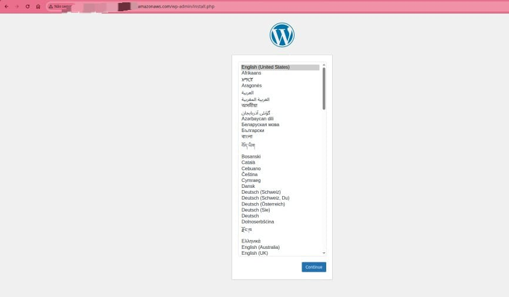
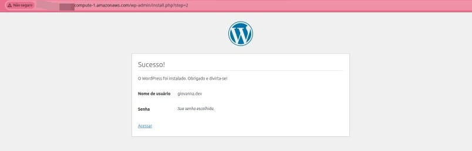
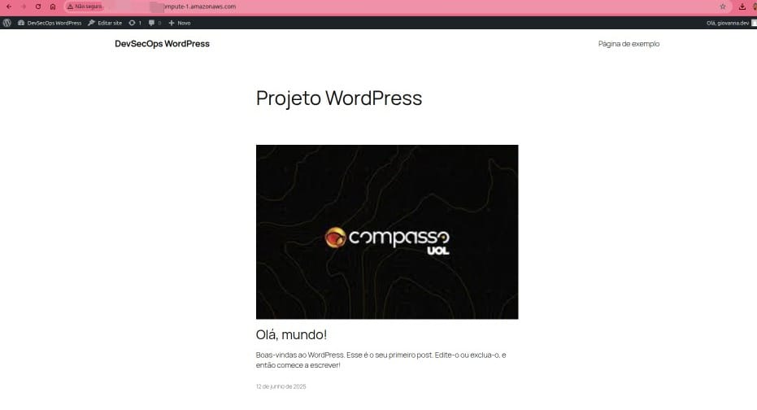

# Infraestrutura AWS com VPC Personalizada

Este repositório documenta um projeto prático desenvolvido durante meu estágio na **Compass UOL**, com o objetivo de implementar uma infraestrutura robusta, segura e escalável na **Amazon Web Services (AWS)**. O foco está na aplicação de boas práticas de arquitetura em nuvem, segurança (DevSecOps) e automação.

---

## Objetivo

Projetar e implementar uma infraestrutura moderna e segura na AWS, utilizando os principais serviços de rede, computação, armazenamento e balanceamento de carga.
O ambiente será preparado para o deploy de aplicações como o WordPress, com suporte a alta disponibilidade, escalabilidade automática e controle de tráfego.

---

## Componentes da Arquitetura

* VPC personalizada
* Subnets públicas e privadas
* Internet Gateway e NAT Gateway
* Instâncias EC2
* RDS (banco de dados relacional)
* EFS (sistema de arquivos em rede)
* Application Load Balancer (ALB)
* Auto Scaling Group
* Grupos de segurança (Security Groups) e Listas de Controle de Acesso (ACLs)

---

## Tecnologias e Serviços AWS

* Amazon VPC
* Amazon EC2
* Amazon RDS
* Amazon EFS
* Application Load Balancer (ALB)
* Auto Scaling
* AWS IAM
* Security Groups e Network ACLs

---

## Etapas do Projeto

O projeto está estruturado em seis etapas principais.

| Etapa | Descrição                                                    | 
| ----- | ------------------------------------------------------------ | 
| 01    | Configuração da VPC, Subnets, Internet Gateway e rotas       | 
| 02    | Implementação do NAT Gateway e rotas privadas                | 
| 03    | Lançamento e configuração das instâncias EC2                 |
| 04    | Configuração do banco de dados RDS e sistema de arquivos EFS |
| 05    | Implementação do Load Balancer e Auto Scaling Group          |
| 06    | Deploy da aplicação WordPress na infraestrutura configurada  |

---

## Resultado Final

Abaixo, imagens ilustrando o ambiente final:

## Autoria

**Giovanna Freitas**
Estagiária em DevSecOps – Compass UOL

---

Caso tenha interesse em acompanhar a evolução completa da infraestrutura e suas implementações, acesse os diretórios indicados nas etapas acima.
